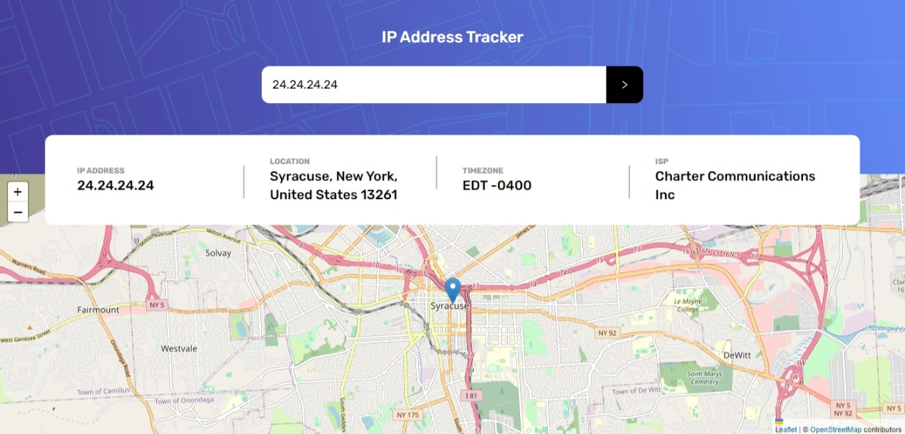

# Frontend Mentor - IP address tracker solution

This is a solution to the [IP address tracker challenge on Frontend Mentor](https://www.frontendmentor.io/challenges/ip-address-tracker-I8-0yYAH0). Frontend Mentor challenges help you improve your coding skills by building realistic projects. 

## Table of contents

- [Overview](#overview)
  - [The challenge](#the-challenge)
  - [Screenshot](#screenshot)
  - [Links](#links)
- [My process](#my-process)
  - [Built with](#built-with)
  - [What I learned](#what-i-learned)
  - [Useful resources](#useful-resources)
- [Author](#author)

## Overview

### The challenge

Users should be able to:

- View the optimal layout for each page depending on their device's screen size
- See hover states for all interactive elements on the page
- See their own IP address on the map on the initial page load
- Search for any IP addresses or domains and see the key information and location

### Screenshot

### Links

- Solution URL: [Click to visit solution URL](https://www.frontendmentor.io/solutions/responsive-ip-address-tracker-website-g1toUMzE2g)
- Live Site URL: [Click to visit live url](https://ip-address-tracker-victory.vercel.app)

## My process

### Built with

- Semantic HTML5 markup
- CSS custom properties
- Flexbox
- CSS Grid
- Mobile-first workflow
- TypeScript
- Tailwind CSS
- [React](https://reactjs.org/) - JS library

### What I learned

Learnt alot about using custom hook to handle api fetching. This helps to keep the componenets clean as they just render the data gotten from the hook to the UI.

### Useful resources

Stack Overflow

## Author

- Frontend Mentor - [@NnadiVictory25](https://www.frontendmentor.io/profile/NnadiVictory25)
- Twitter - [@nnvictory001](https://www.twitter.com/nnvictory001)